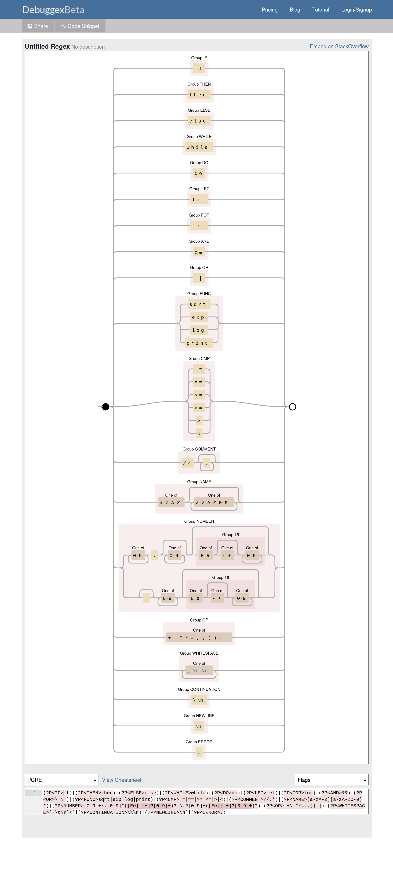
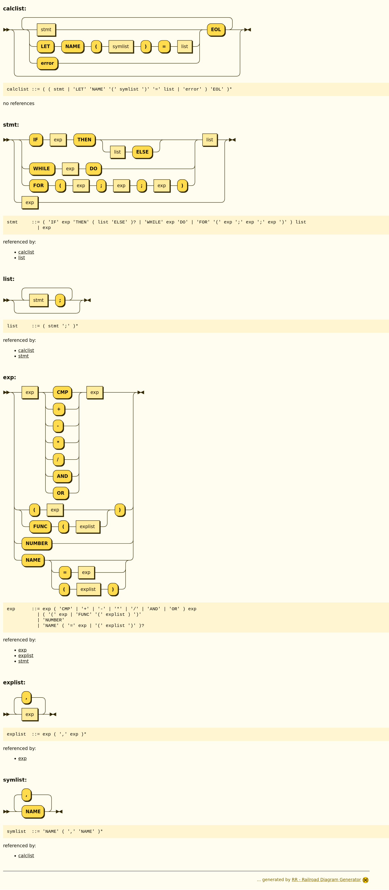

# Trabalho Prático 1 - Construção de Analisadores Léxico e Sintático
**Disciplina:** Compiladores (2026.1)
**Instituição:** UTFPR - Câmpus Ponta Grossa
**Aluno(s):** Rainier Ryu Waki (a2664542), Leandro Martins Machado Hyeda (a2664488)

---

## Apresentação da Linguagem
A linguagem implementada consiste em uma extensão de uma Calculadora Avançada (Programação Básica). Foram adicionadas estruturas de controle de fluxo (`FOR`) e operadores lógicos (`AND`, `OR`). A linguagem suporta declaração de variáveis locais, chamadas de funções definidas pelo usuário, funções matemáticas embutidas (`sqrt`, `exp`, `log`, `print`) e blocos condicionais/repetição (`IF/THEN/ELSE`, `WHILE/DO`).

## Regras de Análise Léxica e Diagramas
A análise léxica reconhece os seguintes padrões:
* **Funções pré-definidas:** `sqrt`, `exp`, `log`, `print`.
* **Terminais de Controle:** `if`, `then`, `else`, `while`, `do`, `let`, `for`.
* **Operadores Lógicos:** `&&` (AND), `||` (OR).
* **Operadores Relacionais:** `>`, `<`, `!=`, `==`, `>=`, `<=`.
* **Aritméticos/Atribuição:** `+`, `-`, `*`, `/`, `=`.
* **Delimitadores:** `;`, `(`, `)`.
* **Identificadores (`NAME`):** Obrigatoriamente iniciam com uma letra, seguidos de letras ou números opcionais.
* **Numéricos (`NUMBER`):** Ponto flutuante com suporte a notação científica.

**OBS:** Um agrupamento conceitual foi feito acima, mas o diagrama de transições reflete exatamente o funcionamento do scanner, cada token diferente precisa de um estado de aceitação distinto (pois retornam códigos diferentes ao parser: IF, THEN, ELSE…).



## Descrição do Analisador Léxico (FLEX)
Implementado no arquivo `calcAvancada.l`. Utiliza expressões regulares para tokenizar o fluxo de entrada.
* **Ignorados:** Espaços em branco (`[ \t\r]`) e comentários (linhas iniciadas com `//`).
* **Conversão de Tipos:** Valores numéricos são convertidos via `atof` e armazenados em `yylval.d`. Nomes de variáveis são buscados/inseridos na Tabela de Símbolos usando a função `lookup(yytext)` e armazenados em `yylval.s`.
* **Operadores de Múltiplos Caracteres:** Operadores como `>=`, `&&` e palavras-chave retornam tokens nomeados (`CMP`, `AND`, `FOR`) para o Bison.

## Descrição da Tabela de Símbolos (TS)
Gerenciada estaticamente no arquivo `calcAvancada.c`.
* **Estrutura:** Um array `symtab` de tamanho fixo (`NHASH = 9997`).
* **Resolução de Colisão:** Hashing simples (`hash*9 ^ c`) com tratamento de colisão por sondagem linear.
* **Conteúdo:** A estrutura `symbol` armazena o nome da variável (`name`), seu valor numérico atual (`value`), ponteiro para raiz da AST de função (`func`) e lista de argumentos (`syms`).

## Regras de Análise Sintática (BNF)

### Diagrama:



### Gramática

``` bnf

<calclist> ::= ε
             | <calclist> <stmt> EOL
             | <calclist> 'LET' 'NAME' '(' <symlist> ')' '=' <list> EOL
             | <calclist> error EOL

<stmt> ::= 'IF' <exp> 'THEN' <list>
         | 'IF' <exp> 'THEN' <list> 'ELSE' <list>
         | 'WHILE' <exp> 'DO' <list>
         | 'FOR' '(' <exp> ';' <exp> ';' <exp> ')' <list>
         | <exp>

<list> ::= ε
         | <stmt> ';' <list>

<exp> ::= <exp> CMP <exp>
        | <exp> '+' <exp>
        | <exp> '-' <exp>
        | <exp> '*' <exp>
        | <exp> '/' <exp>
        | <exp> AND <exp>
        | <exp> OR <exp>
        | '(' <exp> ')'
        | NUMBER
        | NAME
        | NAME '=' <exp>
        | FUNC '(' <explist> ')'
        | NAME '(' <explist> ')'

<explist> ::= <exp>
            | <exp> ',' <explist>

<symlist> ::= NAME
            | NAME ',' <symlist>
            
```


